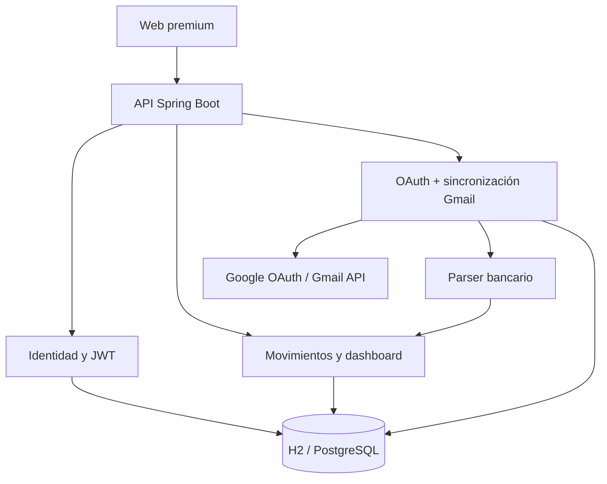
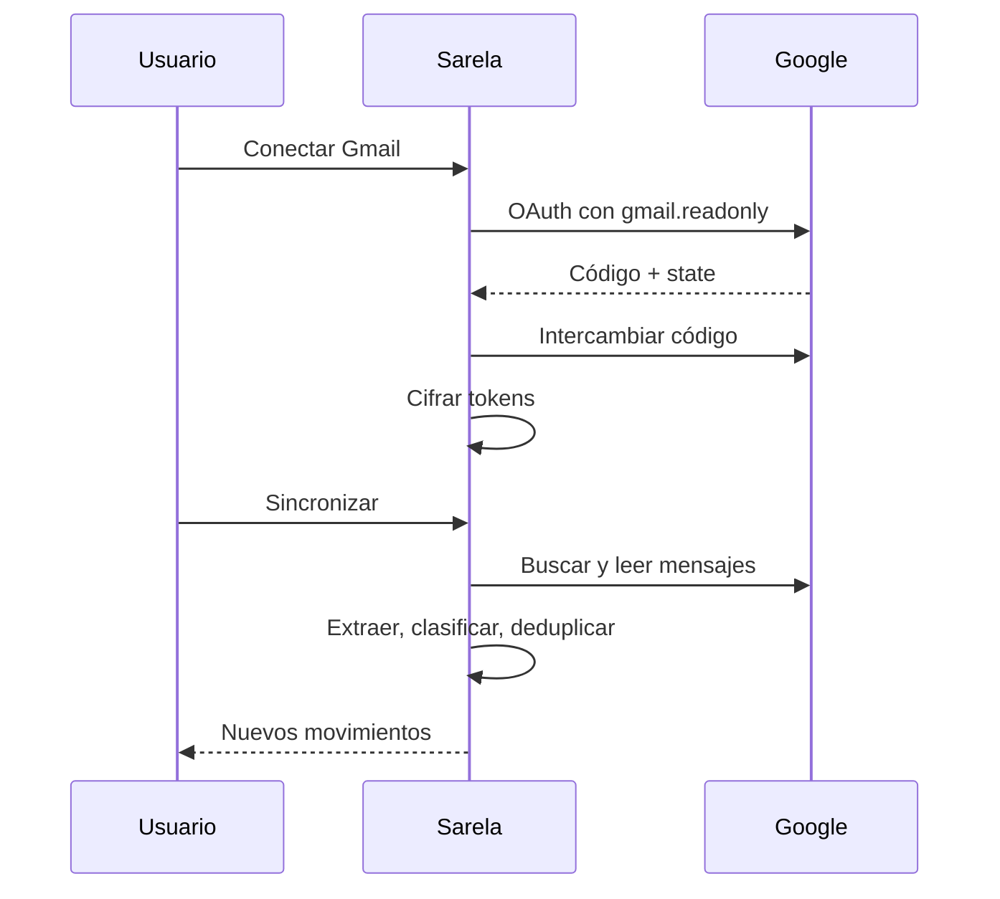

# Arquitectura de Sarela

Sarela usa un monolito modular Spring Boot: es simple de ejecutar como MVP, pero los módulos tienen límites claros para poder separarlos más adelante.

## Flujo de Gmail

## Módulos

| Módulo | Responsabilidad |
|---|---|
| `auth` y `config` | Registro, login, JWT, BCrypt y reglas de acceso |
| `transaction` | Persistencia y CRUD de movimientos |
| `dashboard` | Totales, categorías, proyección y series diarias |
| `gmail` | OAuth, cifrado, Gmail REST, trazabilidad y sincronización |
| `importer` | Extracción determinística de monto, comercio y categoría |
| `assistant` | Respuestas basadas en los datos financieros guardados |
| `static` | SPA responsive sin proceso de build adicional |

## Controles de seguridad incluidos

- Permiso OAuth de Gmail de solo lectura.
- `state` aleatorio, hasheado, de un solo uso y con expiración.
- Access y refresh tokens cifrados con AES-GCM.
- Contraseñas con BCrypt y API privada con JWT.
- Separación de registros por `userId`.
- IDs externos únicos para impedir duplicados.
- Revocación al desconectar Gmail.

## Siguiente evolución

Para escalar: mover sincronización a una cola, crear parsers versionados por banco, añadir pantalla de revisión para baja confianza y usar IA únicamente como fallback estructurado con datos minimizados.
